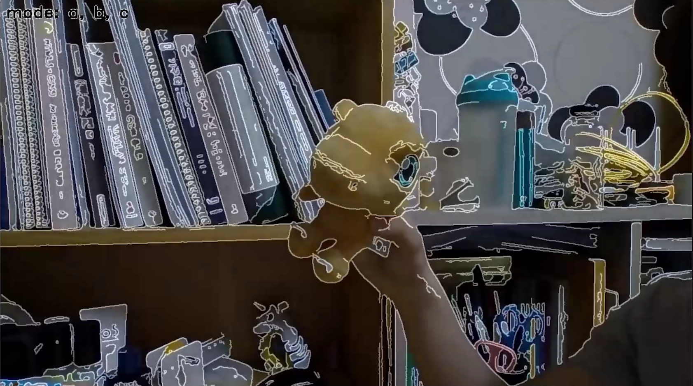
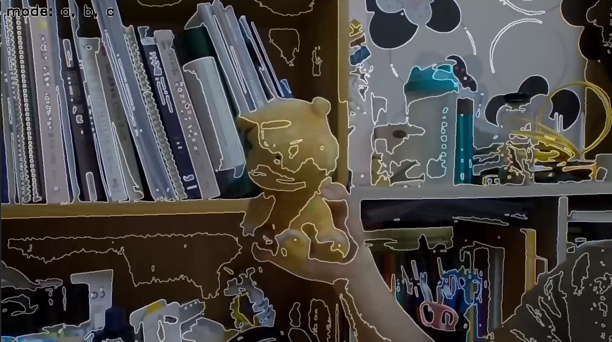
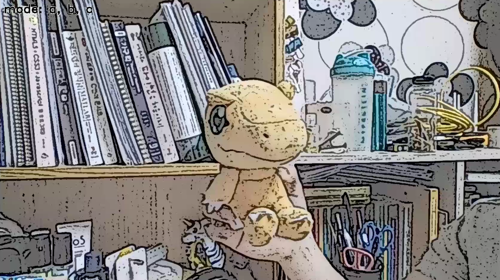

# mini_catoon_maker_3modes
this is convert_video2catoon, you can change nomal video to catoon video   
    
실시간으로 보고 싶은 모습을 카툰화 해보세요!   
노트북에 설치된 웹캠으로 현재의 이미지를 3가지 모드로 카툰화 할 수 있습니다.     
   
이 카툰화 프로그램에는 ***3가지 모드(키보드 a,b,c 버튼)*** 가 있습니다.      

## 1. 키보드 a 키: 회색조 이미지에서 테두리 딴 것    
   
처음 디폴트 이미지이며 혹은 **a**키를 누르면 현재 나오는 웹캠의 영상을 다음과 같이 카툰화 할 수 있습니다.   
테두리에 효과를 내고 싶을 때 사용하면 좋습니다.   
   
## 2. 키보드 b 키: 스레쉬 홀드로 걸러진에서 테두리 딴 것    
   
**b**키를 누르면 현재 나오는 웹캠의 영상을 다음과 같이 카툰화 할 수 있습니다.   
색 변화가 큰 곳에 효과를 내고 싶을 때 사용하면 좋습니다.   
   
## 3. 키보드 c 키: 적응형 스레쉬 홀드로 걸러진 이미지를 사용한 것    
   
**c**키를 누르면 현재 나오는 웹캠의 영상을 다음과 같이 카툰화 할 수 있습니다.   
거친 느낌의 이미지를 만들고 싶을 때 사용하면 좋습니다.   

[유튜브를 통해서 작동 전체 영상보기](https://youtu.be/YsgHJm5JUzw)   